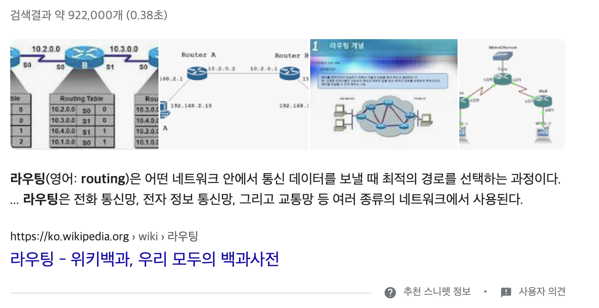
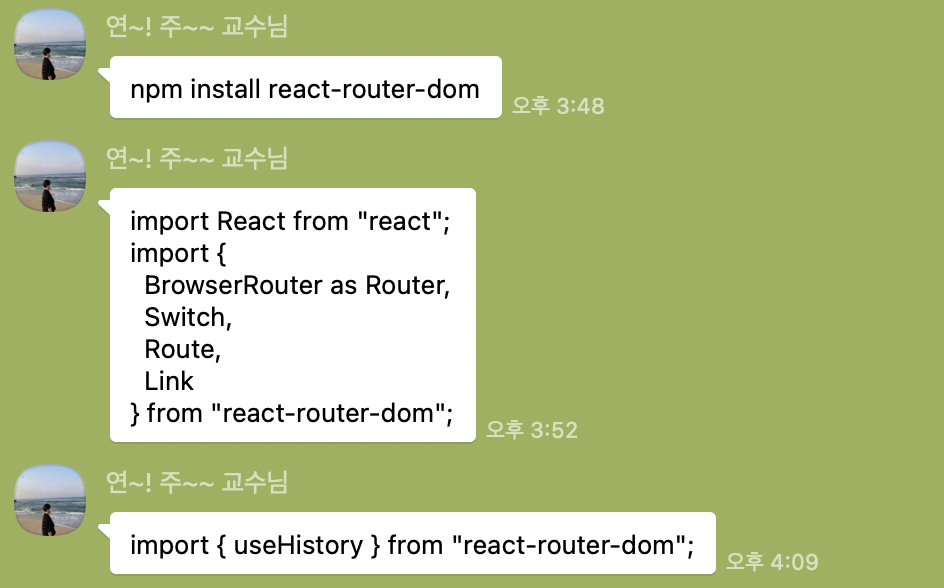
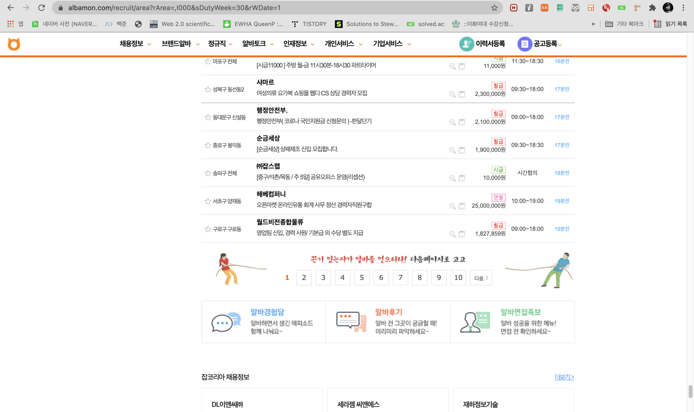
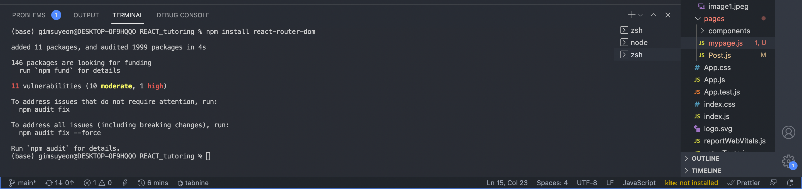
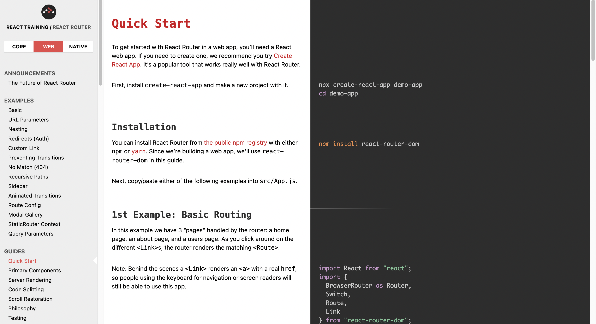
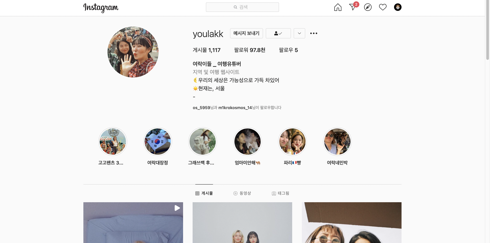
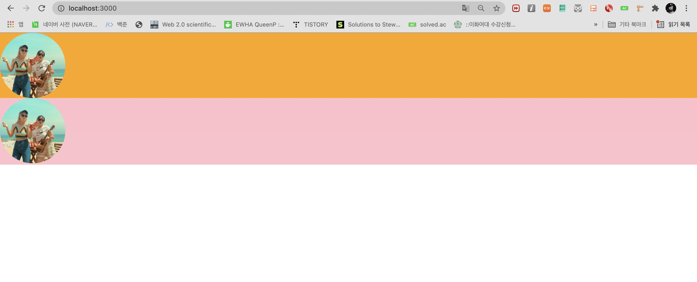
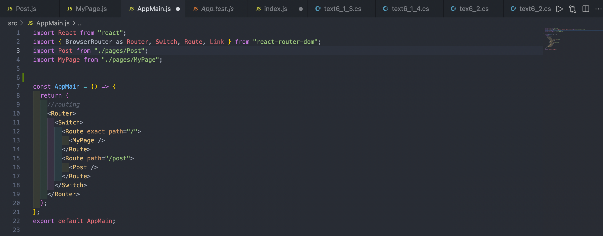
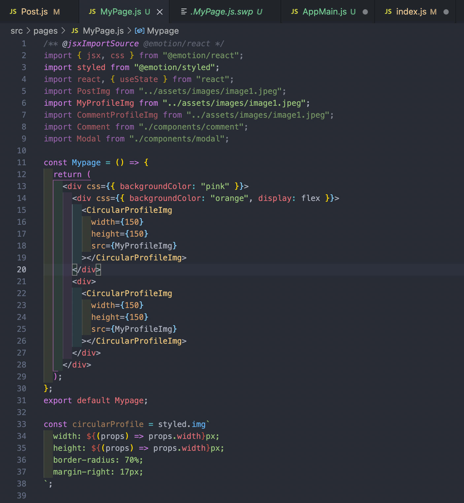
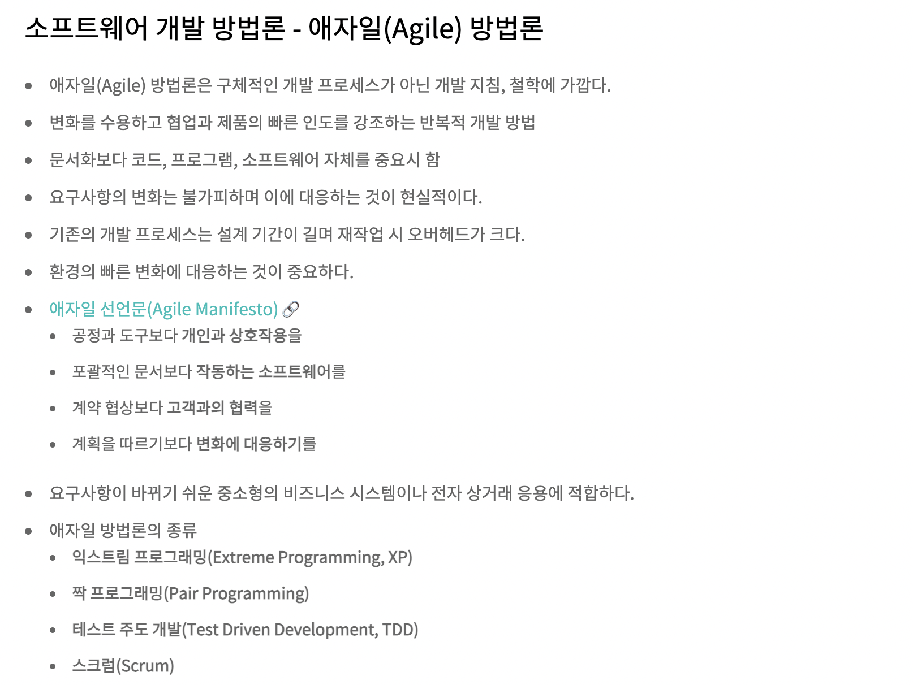

# 20210807 튜터링 : AppMain페이지 만들기
## 라우터(Router)
- react에서 제공하는 라우팅기능을 사용했다. 라우팅이라는 용어를 웹호스팅할 때 들어본 적이 있어서 익숙하긴 했는데 정확하게 어떤 용어인지는 알지 못했었다. 이번 기회에 직접 해보면서 배울 수 있어서 재미있었다.
- 라우팅(영어: routing)은 어떤 네트워크 안에서 통신 데이터를 보낼 때 최적의 경로를 선택하는 과정이다.


라우팅은 전화 통신망, 전자 정보 통신망, 그리고 교통망 등 여러 종류의 네트워크에서 사용된다.(출처 : https://ko.wikipedia.org/wiki/%EB%9D%BC%EC%9A%B0%ED%8C%85) 리액트에서 제공하는 라우팅기능을 사용하기 위해 터미널엥서 `npm install react-router-dom`명령어를 통해 `react-router-dom패키지`를 다운로드 했다. 튜터링이 끝나고 해당 패키지에 대해 더 공부해보니 SPA앱을 만들 때 주로 사용된다고 한다. 그렇다면 `SPA`란 무엇일까?
  - SPA : Single Page Application (싱글 페이지 어플리케이션) 의 약자이다. 말 그대로, 페이지(page)가 1개(single)인 어플리케이션이란 뜻입니다. 전통적인 웹어플리케이션의 구조는, 여러 페이지로 구성되어있습니다. 유저가 요청 할 때 마다 페이지가 새로고침되며, 페이지를 로딩 할 때 마다 서버로부터 리소스를 전달받아 해석 후 렌더링을 합니다. 전통적인 웹어플리케이션의 예시가 정확히 어떤 것을 말하는지 모르겠으나, 계속해서 새로고침을 해야 정보가 업데이트가 되고 사용자가 1페이지, 2페이지 .. 이런 방식으로 넘겨가며 사용하는 방식인가보다. 내가 알고 있는 그런 페이지 중에는 알바몬페이지(https://www.albamon.com/recruit/area?rArea=,I000&sDutyWeek=30&rWDate=1)가 그런 것 같은데, 확실하게는 모르겠다. 
 
  - 하지만 여기에서 착각하면 안되는 점은 싱글페이지라고 해서 정말 만들어진 페이지가 1개라는 의미가 아니다. 예를들어 블로그를 만든다면, 홈, 포스트 목록, 포스트, 글쓰기 등의 화면(1개의 페이지가 아니다!)이 있겠고, 각 화면에 따라 주소를 만들어준다. 이 주소를 통해 사용자들이 페이지에 유입되기도 하고 북마크나 다른 서비스를 사용할 수도 있다. 즉, 각 주소에 따른 뷰를 보여주는 것을 라우팅이라고 한다.
  -  리액트 자체에는 이 기능이 내장되어있지 않기 때문에, 우리가 직접 브라우저의 API를 사용하고 상태를 설정하여 다른 뷰를 보여주어야 한다.
- 라우터(router)에는 3가지 타입이 있다. 그 중 우리가 만들고 있는 것은 웹이기 때문에 `react-router-dom`을 사용했다. **(출처:https://velopert.com/3417)**
  - `react-router-dom` : 웹
  - `react-router` : 웹&앱
  - `react-router-native` : 앱
  

- 아래의 페이지는 리액트 라우터의 공식 페이지이다. 언니가 더 공부하고 싶으면 이 사이트를 활용하라고 했다. -> https://reactrouter.com/web/guides/quick-start
- 오른쪽에 왼쪽의 설명에 대한 코드까지 같이 나와있어서 이해하기 더 쉽고 직관적이어서 좋다!

## MyPage.js 
- 본격적으로 새로운 페이지를 만들기 시작한다!! 인스타그램에서 내 프로필을 클릭하면 자신의 프로필페이지로 넘어간다. 그리고 게시글에서 게시글 작성자의 프로필을 클릭하면 그 사람의 프로필로 넘어간다. 이를 `onClick`을 사용해서 연결해주고 저번에 만들어두었던 css들을 사용해서 동그란 프로필을 만들어주었다. 지금 내 프로필에는 없는데, 프로필 하단에 나오는 스토리도 같은 태그를 사용할 것이라고 했다. 아직 완성은 못했지만, 여기까지 하다가 튜터링이 끝났다. 내일 튜터링가서 마저 배우고 만들어야겠다!



## 라우터의 동작방식 -> 렌더링 순서를 중심으로
  - 라우터에는 `<BrowserRouter>` 가 보통 많이 사용되며 `<Link>` 와 `<Route>`를 통해서 라우팅을 구현하는 방식이다. 예를 들어, 홈페이지, 영화페이지, 리뷰페이지가 있다고 하자. 각각의 URL을 `/` , `/movies` , `/reviews`라고 했을 때, 다음과 같이 구현할 수 있다. 각각의 페이지에는 path 속성을 통해서 각각의 컴포넌트가 렌더링 되는 URL이 정해진다. 하지만 여기에서 신경써야할 부분이 있다.
```
import React from 'react';
import { BrowserRouter as Router, Route } from 'react-router-dom';

const Routes = () => {
    return (
    	<Router>
          <Route path="/" component={Home} />
          <Route path="/movies" component={Movies} />
          <Route path="/reviews" component={Reviews} />
        </Router>
    );
};
```
그러나 여기서의 문제점은, 홈페이지에 들어갔을 때 `/movies` 와 `/reviews` 또한 `/` 가 매칭되기 때문에 3개의 컴포넌트가 모두 렌더링된다는 것이다. `/`만 렌더링하고 싶었는데 3개의 페이지 전부 렌더링하게 되는 일이 발생한다. 이 문제를 해결할 수 있는 방법으론 크게 2가지가 있다.
1. `exact` : 정확한 경로의 사용
     - `/`가 포함되는 것이 아니라, 정확하게 `/`이라는 주소를 가지는 경우만 렌더링하는 것이다. 즉 부분적으로 일치하는 것이 아니라 정확하게 일치하는 URL의 컴포넌트를 렌더링시키는 방법을 사용할 수 있다.
```
import React from 'react';
import { BrowserRouter as Router, Route } from 'react-router-dom';

const Routes = () => {
    return (
    	<Router>
          <Route exact path="/" component={Home} />
          <Route path="/movies" component={Movies} />
          <Route path="/reviews" component={Reviews} />
        </Router>
    );
};
```
2. `<Switch>` : 여러 경로 중 첫번째(up->down) 경로 선택
  - `<Switch>`는 첫번째로 매칭되는 `path`를 가진 컴포넌트를 렌더링 시킨다. 이것이 `exact` `path` 와 다른 점은 첫번째 매칭만 본다는 것이다.
```
import React from 'react';
import { BrowserRouter as Router, Route, Switch } from 'react-router-dom';

const Routes = () => {
    return (
    	<Router>
          <Switch>
            <Route exact path="/" component={Home} />
            <Route path="/movies" component={Movies} />
            <Route path="/reviews" component={Reviews} />
          </Switch>
        </Router>
    );
};
```
- 아래 코드는 튜터링에서 인스타그램 페이지를 연결할 때 사용한 코드이다.
```
  const AppMain = () => {
  return (
    //routing
    <Router>
      <Switch>
        <Route exact path="/">
          <MyPage />
        </Route>
        <Route path="/post">
          <Post />
        </Route>
      </Switch>
    </Router>
  );
};
export default AppMain;
```

-`npm start`로 터미널에서 처음 리액트로 파일을 열면 지난 시간까지 만들었던 게시글 페이지가 나왔었다. 이는 그 페이지가 바로 뜨도록 첫시간(?..기억이 잘 안난다..)에 설정했기 떄문이다. 새삼 개발의 세계에서 <그냥>이라는 것은 없다는 것을 느꼈다... 언니가 인스타그램에 처음 접속하면 게시글 페이지가 먼저 나오는 게 맞는지 프로필이 먼저 나오는 게 맞는지 물어봤다. 프로필이 먼저 나오는 게 맞다고 대답했는데, 지금 생각해보니 아닌 것 같다. ㅋㅋㅋ 물론 처음에 뜨는 건 타임라인 형식이라서 우리가 지난 시간까지 만들어놓았던 페이지랑 살짝 다르기는 하지만, 어쨌든 게시글이 먼저 나오는 게 맞는데 언니가 그럴 수도 있지하면서 넘어갔다. 역시 연주언니는 최고의 튜터다...😎
```
ReactDOM.render(
  <React.StrictMode>
    <AppMain />
  </React.StrictMode>,
  document.getElementById("root")
);
```

- 오늘 튜터링 거의 끝자락에 문득 인스타그램과 같은 대형서비스를 만드려면 몇 명의 개발자가 얼마의 시간이 걸려서 만드는 것인지 궁금해서 언니한테 물어봤다. 언니가 물론 내부사정은 모르는 것이긴 하지만 최근에는 애자일 개발 방법론이 많이 쓰이기 때문에 내부에서는 훨씬 빨리 만들고 수차례의 피드백을 거쳐서 완성되었을 수도 있다고 했다.
- 애자일(agile a.신속한,민첩한) 방법론 : 애자일은 신속한 반복 작업을 통해 실제 작동 가능한 소프트웨어를 개발하여 지속적으로 제공하기 위한 소프트웨어 개발 방식
- 
## 소감
2주정도 튜터링 끝나고 바로 내용정리를 못해서 며칠 지나서 하려고 하니 내용이 기억이 안나서 애를 먹었다.. 미리미리 복습하고 튜터링 복습 github에 업로드하기!! 새로운 페이지를 만드는 것도 재미있고 처음에는 낯설게 느껴졌던 react함수형태도 익숙해진 것 같아서 뿌듯하다. 2주치 복습도 빨리 해야지🔥🔥🙉
