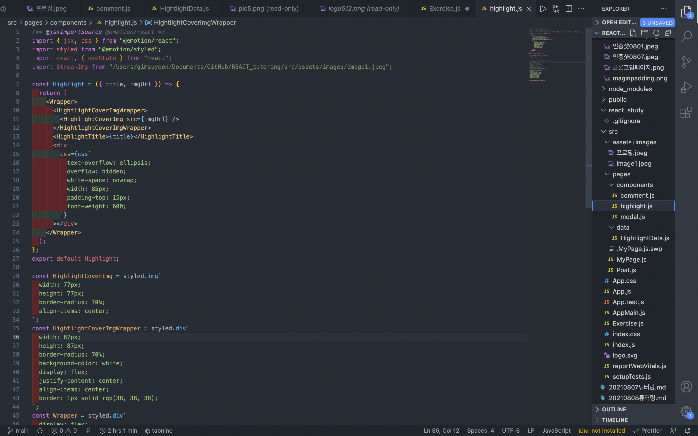

## 20210808 튜터링 : 인스타그램 하이라이트 만들기

오늘은 어제에 이어서 인스타그램 하이라이트를 만들었다. 아직 여러 기능을 만든 것은 아니지만 눈에 하이라이트랑 비슷한 뭔가가 보이니까 너무 뿌듯했다.
인스타그램에서 하이라이트기능은 사용자가 업로드한 스토리 중 다른 사람들에게 보여주고 싶은 것들을 자신이 title을 설정해서 모아두는 컬렉션이라고 생각하면 된다
하이라이트에서 이미지 파일을 사용해야하기 때문에 미리 다운받고 `asset/image` 디렉토리 안에 저장해둔다.
- 

 나는 올림픽 선수들 사진으로 골랐다. ㅎㅎ(사심가득💞💞💞💞)
 

### css로 하이라이트 디자인하기
- 오늘의 결과물🐥
- 
- 프로필 페이지에서 nickname과 follow버튼을 만들었다. 튜터링에서 팔로우버튼을 만들 때 `<button>`태그를 사용할지 아니면 `<div>`태그사용 + 링크걸기 조합으로 갈 것인지 논쟁이 있었다. 사실 이걸하나 저걸하나 딱히 상관없을 것 같았는데, 언니가 `<button>`태그를 안써주면 브라우저 개발자도구창에서 볼 때 button이라는 것을 알 방법이 없다라고 해서 semantic하게 button을 써주는 게 더 좋을 것 같다고 말했다. 
- semantic하게 개발하는 것을 이렇게 적용할 줄은 몰랐는데, 개발하는 자세나 정말 튜터한테 배울 점이 많다..!
- 튜터링 첫 시간에 배운 atomic design을 사용해서 5개의 스토리 하이라이트를 만들어주었다. 복사+붙여넣기가 아닌 아토믹디자인을 사용해서 개발하니 바꿔야 할 점이 있으면 한 번에 바꿀 수 있는 점이 정말 효율적이었다. 지금은 size가 작으니 음 효율적이군~ 정도로 넘어가지만 세계 각국의 사람들이 사옹하는 인스타그램같은 서비스는 주기적으로 유지/보수 작업이 필요할텐데 이걸 일일이 바꾼다고 생각하면 끔찍하다.. 내가 죽을 때까지도 다 못바꿀 것 같다 ㅋㅋ..
- 이제는 css가 좀 길어지면 const로 밖으로 빼는 것쯤은 식은 죽 먹기다!!! 초반에 튜터가 이거 하기만 하면 잠깐만요ㅠㅠㅠ이러면서 허덕이기 바빴는데, 이제 이 정도는 튜터 코딩하는 거 안보고도 해줄 수 있다는 것에 놀랍다😎
  
### 사용한 css 정리
*** 너무 직관적인 background-color, height.. 같은 요소들은 굳이 정리하지 않았다 
- `font-weight` : font-weight CSS 속성은 폰트(font)의 가중치(weight)나 굵기(boldness)를 명시한다. 몇몇 폰트들은 normal 나 bold 일 때만 가능하다. 
  -> 항상 bold, normal을 제외하고는 사용해본 적이 없었는데, 오늘은 600,300.. 이런식으로 font-weight값을 지정해줄 수 있다는 것을 배워서 bold대신에 600을 사용했다. 정수값으로 어느정도가 bold냐고 물어봤는데 폰트마다 다르기는 하지만 일반적으로 600~700이 `font-weight : bold`에 해당한다고 했다.

- `text-overflow : ellipsis` : 글 목록에서 제목이나 내용을 간략히 보여주려고 할 때, 보여줄 내용이 길면 내용의 일부만 보여주고 나머지를 말 줄임 표시(…)를 한다. 웹에서는 이 것을 CSS를 이용하여 간단히 화면에서 처리할 수 있다.
  - HOW? text-overflow 속성의 값을 ellipsis로 지정하는 것인데, 이 것이 동작하기 위해서는 overflow속성과 white-space 속성이 각각 hidden, nowrap 으로 설정되어 있어야 동작한다.
  
  -> 저번에도 튜터링에서 overflow를 다룬 적이 있었다. 그 때는 text의 overflow는 아니고 이미지의 overflow였다. 조금 다르기는 하지만 뭔가 반가웠다 😃
- `white-space : nowrap` :  `white-space`는 요소가 공백 문자를 처리하는 법을 지정합니다. `nowrap`뿐만 아니라 아래 키워드 값 중 하나를 사용해 설정할 수 있다.
  - `normal` :연속 공백을 하나로 합침. 개행 문자도 다른 공백 문자와 동일하게 처리한다. -> 한 줄이 너무 길어서 넘칠 경우 자동으로 줄을 바꾼다.
  - `nowrap` : 연속 공백을 하나로 합침. 줄 바꿈은  `<br>` 요소에서만 -> 자동 줄바꿈 없음!
  - `pre` : 연속 공백 유지. 줄 바꿈은 개행 문자와 `<br>` 요소에서만
  - `pre-wrap` : 연속 공백 유지. 줄 바꿈은 개행 문자와 `<br>` 요소에서 일어나며, 한 줄이 너무 길어서 넘칠 경우 자동으로 줄을 바꾼다.
  - `pre-line` : 연속 공백을 하나로 합침. 줄바꿈은 개행 문자와 <br> 요소에서 일어나며, 한 줄이 너무 길어서 넘칠 경우 자동으로 줄을 바꿉니다.
### 인스타그램 페이지
- `display : flex`로 세로로 배치되어 있던 스토리 하이라이트를 가로로 배열해준다. 점점 더 인스타그램 페이지와 닮아가고 있다..!!


- 원래 튜터링에서 이미지를 import하기 위해서 상대경로를 이용해 이미지를 불러왔다. 그런데 문제점이 있다. 이 하이라이트는 우리가 만들어준 `hightlight.js`라는 파일에만 사용되는 것이 아니라 무궁무진한 페이지의 주소에서 import되어 사용될 것인데 상대주소를 사용해도 되냐는 것이다. 그래서 튜터가 우리에게 질문을 했다. 상대경로를 사용할 떄 기준이 되는 지점이 지금 이 파일(`hightlight.js`)인지 아니면 import되어 직접 사용되는 페이지인지...! 그런데 놀랍게도 직접사용되는 페이지를 기준으로 주소를 계산한다고 한다. 그럼 어떻게 해줘야하나? 나는 절대경로를 사용해야한다고 대답했는데, 언니가 그것도 맞지만 더 좋은 방법이 있다고 했다. 청므 리액트를 설치했을 때 public이라는 디렉토리가 있었는데, 여기 안에 있는 파일들은 다른 곳 어디서든 접근이 가능하다. 따라서 public 폴더 안에 있는 image폴더 안의 pic1.png파일을 사용하고 싶다면 주소를 `/image/pic1.img`라고 하면 된다. 정말 신기했다. 절대경로를 사용하는 것보다 훨씬 효율적인 방법이다.


### 하이라이트에 사용될 데이터를 객체배열을 사용해서 입력받기

- 하이라이트에 사용할 디자인을 완성했으면 이미지와 이미지URL을 받아와서 프로필페이지인 `MyPage.js`에 불러와야한다. `title`과 `imgUrl`을 배열의 요소로 하는 const `HighlightData`를 선언해준다. imgUrl은 아까 언급했던 public 디렉토리를 활용해서 간단하게 작성해주었다. 데이터를 다 작성해주었으면 스토리하이라이트에 관한 코드를 모아둔 `highlight.js`에서 불러주어 하이라이트 디자인을 완성한다.
- 그 후 이 하이라이트 디자인을 mypage(프로필페이지)에 불러온다. data의 요소들을 item이라고 설정해준다. 그리고 imgUrl,title 중 어떤 item을 말하는지 모호하기 때문에 `item.imgUrl`과 `item.title`로 호출해준다.
- 
- 
 ```
  <HighlightWrapper>
        {HighlightData.map((item, i) => (
          <Highlight title={item.title} imgUrl={item.imgUrl} />
        ))}
      </HighlightWrapper>
 ```
- i를 사용해서 item들을 차례로 불러온다.


### 소감
이번주는 바로 복습을 해서 정리가 잘 되는 기분이다. 멋진 기능들을 오늘 많이 배웠다. 막상 다시 해보려고 하니까 버벅거린다. ㅠㅠ 하지만 스스로 할 수 있느냐가 결국 제일 중요한 것이니까 오늘 배웠던 것들 연습 많이해서 능숙하게 사용할 수 있도록 해야겠다!!🔥🔥
