# 🐣 인스타그램 클론코딩 🐥
(멘토)서연주-(멘티)김수연, 임수안 HTML,CSS,React 공부 시작합니다!
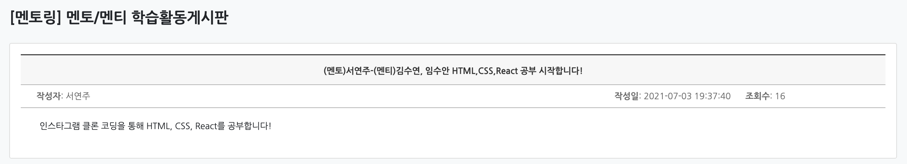
## 인스타그램 웹페이지 만들어보기
### 클론코딩페이지

### 20210710
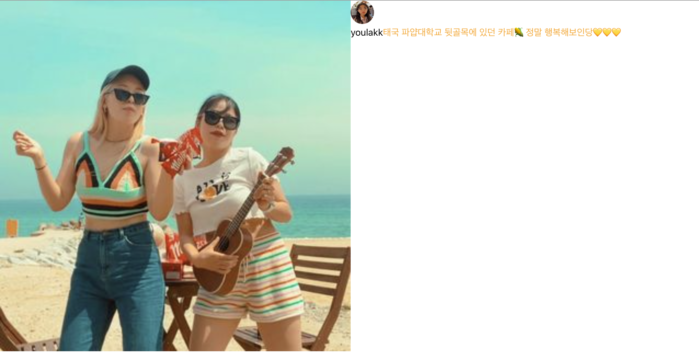
### 20210711
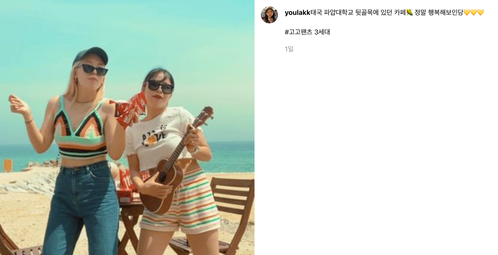

## 20210703 OT(이론)
### Github의 여러 기능(PR, Issue, 칸반보드, Action, 웹호스팅 등...)과 그 활용에 대해 알아보고 github 사용을 편리하게 해주는 툴을 소개했습니다.HTML, CSS, React가 무엇인지 간략하게 설명하고 아토믹 디자인과 css-in-js에 관해 알아보고 개발 환경 설정(Create React App과 Emotion)을 마쳤습니다. 이후 다음 시간부터 진행될 실습에 관해 간략하게 알아보았습니다.
오늘은 깃허브 쓰는 방법, html.css,.js.react가 무엇인지 배웠다. html은 뼈대. css는 겉모습, js는 뇌라고 했다. html이랑 css는 프로그래밍 언어가 아니라고 했다. 몰랐다. 아토믹 디자인에 대해서 배웠다. 웹사이트가 그냥 한 페이지로 이루어지는 줄 알았는데, 여러가지 요소로 이루어져있다는 것을 배웠다. 그리고 똑같은 디자인을 복붙하는 것은 코드 재사용성이 좋지 않다고 했다. 내가 객지프때 이렇게 했는데,,, 약간 객지프에서 배운 내용이랑 비슷한 내용이라고 느꼈다 이번에는 실습을 많이 해보면서 연습을 많이 해야겠다. 객지프때 실습을 충분히 안했더니 실력이 잘 안늘었던 것을 교훈삼아서 열심히 실습하겠다. 앞으로 가야할 길이 많다고 느꼈다. 열심히 해야겠다.!! 
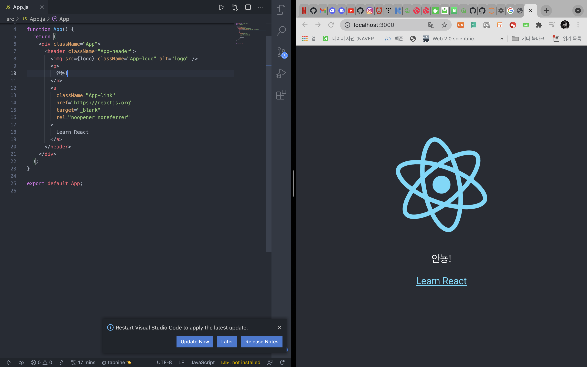

## 20210710 인스타게시글 만들기!
### 오프라인으로 만나 학습활동을 진행했습니다. HTML Tag와 semantic한 태그 작성의 중요성에 대해서 언급하고 React Component와 그 중에서도 함수형 Component 사용에 대해 배웠습니다. 필요한 extension을 소개한 뒤 희망하는 인스타그램 페이지를 클론 코딩하는 실습을 시작하였습니다.
오늘은 직접 인스타 게시물 화면을 만들어 보았다. 큰 화면에서 같이 코딩하면서 에러가 생기면 바로바로 물어보고 고민할 수 있다는 점이 오프라인 수업의 큰 장점인 것 같다. 그리고 친한 사람과 하니 물어보기도 쉽고 질문하기도 쉬워서 부담감이 없어 좋았다! 인스타 게시물 화면을 아토믹하게 섹션별로 나눠보고 semantic한 것이 어떤 것인지에 대해 배웠다. 또 연주언니가 코딩할 때 사용하기 유용한 확장프로그램들을 여러개 알려줘서 prettier, bracket,, indent rainbow를 설치했다. 백준풀때는 그냥 에러입니다만 나와서 약간 재미가 없었는데, 리액트는 내가 쓴 코드를 바로 확인할 수 있어서 재밌었다. 학교에 리액트 수업은 없냐고 물어봤는데 아쉽게 없다고 했다 ㅠㅠ 언니 시간날 때 마다 졸라서 같이 수업하는 것처럼 열심히 배워야겠다 ㅎㅎ

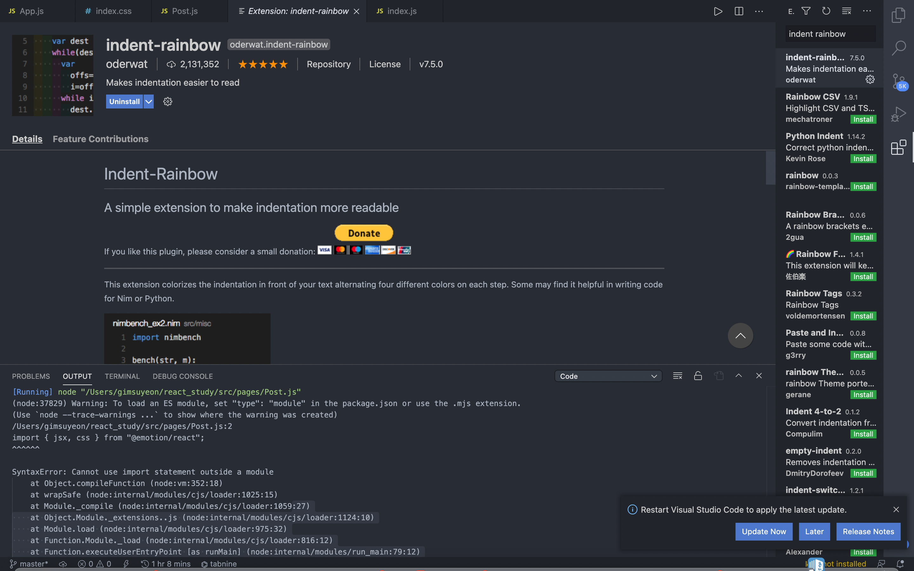
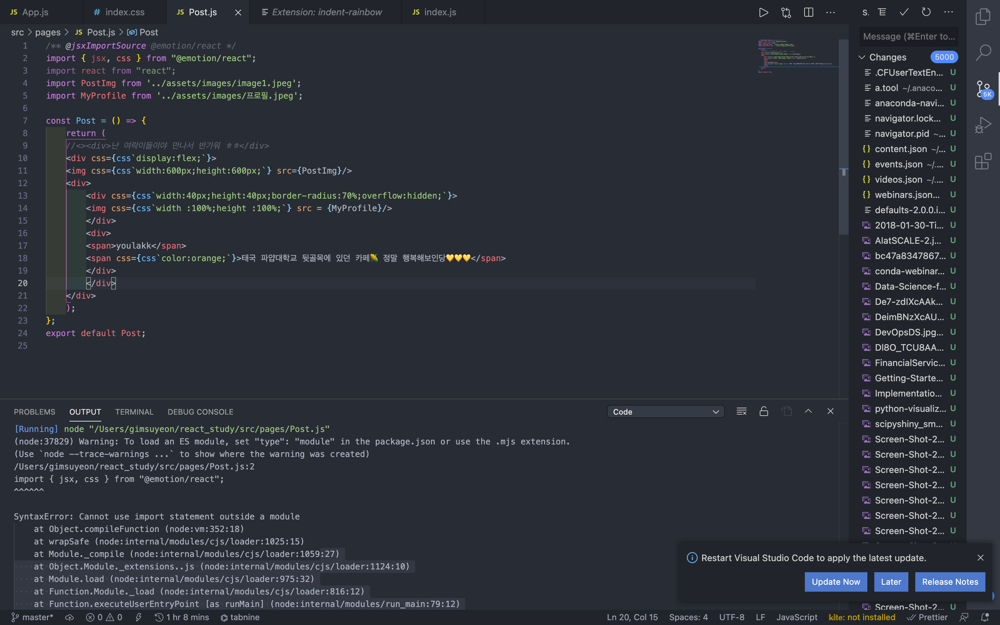

## 20210711 
어제보다 인스타그램이랑 더 닮아가고 있어서 뿌듯하다. 오늘은 언니가 고급기능이라고 클릭기능을 가르쳐줬다. 그리고 해쉬태그랑 프로필을 클릭하면 설정해놓은 링크로 넘어갈 수 있도록 href를 사용했다. 지금은 하나의 페이지만을 만드는 것이라서 일일이 url을 입력해주지만, 만약 정말로 서비스를 운영할 때는 라우팅기능을 통해 자동으로 넘어갈 수 있다고 했다. 그리고 검색기능도 프론트엔드의 일이라고 했는데, 생각보다 프론트엔드도 할 일이 많은 것 같다. 내가 생각한 프론트엔드 개발자는 거의 웹디자이너 정도였다.... 인스타그램 웹화면에서 1일이라고 적혀있는 부분을 클릭하면 day변수가 하나씩 올라가서 1일 2일 3일.. 이렇게 증가하는 기능인데 정말 너무너무 신기했다. 이 기능은 좋아요기능을 사용할 때 쓰는 것이라고 했다. 이걸 보니 <거지키우기>게임이 생각났다. 거지키우기는 그냥 클릭을 하면 돈이 쌓이는 건데, 이렇게 클릭하는 걸로 웹페이지에서 게임을 만들 수 있을 것 같았다. 다음에 한 번 해봐야겠다. 평소에 프론트엔드에 별 관심이 없었는데, 코딩한 결과를 눈으로 바로 확인할 수 있는 점이 너무 매력적이다. 그리고 어제보다 결과물이 나아진 게 너무 뿌듯하다! 역시 꾸준히 하는 게 제일 중요한 것 같다. 
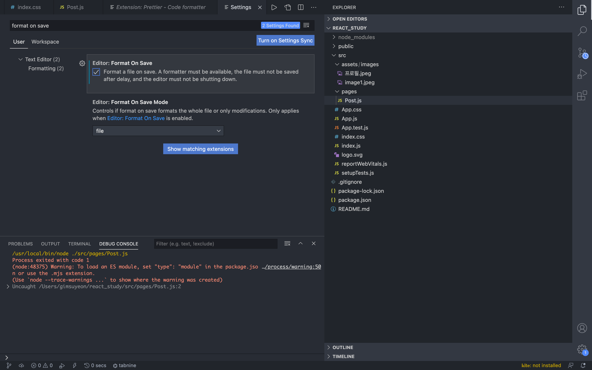
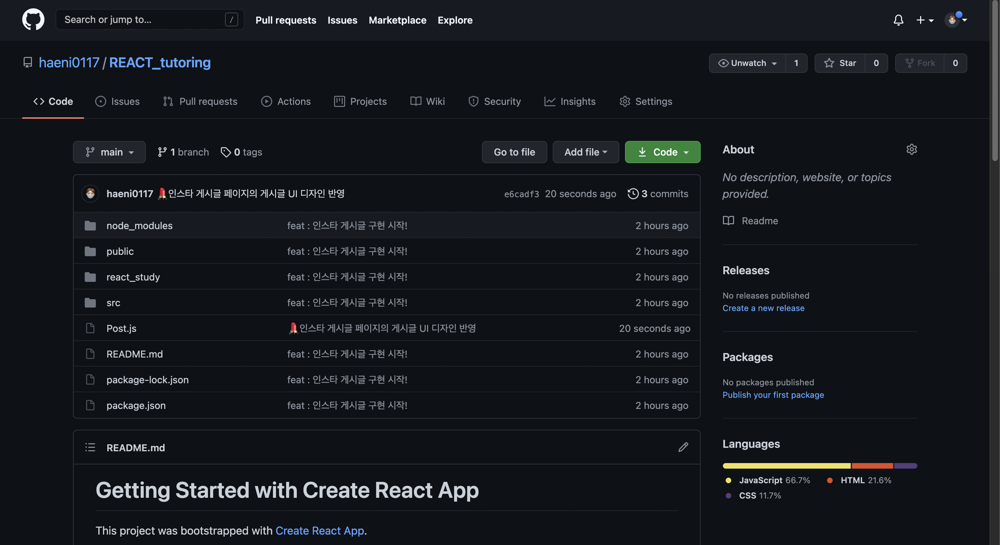

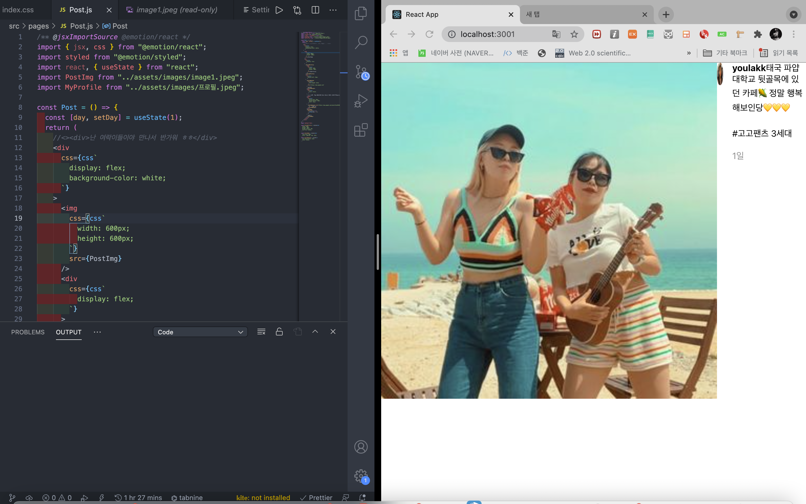
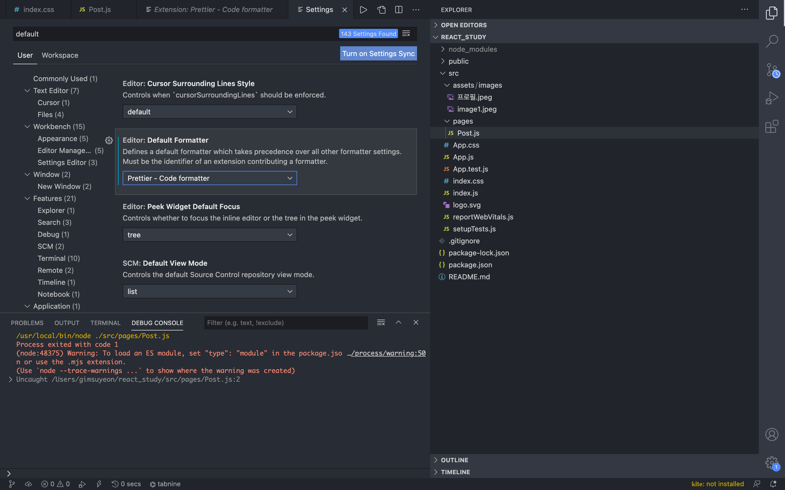

## 20210717
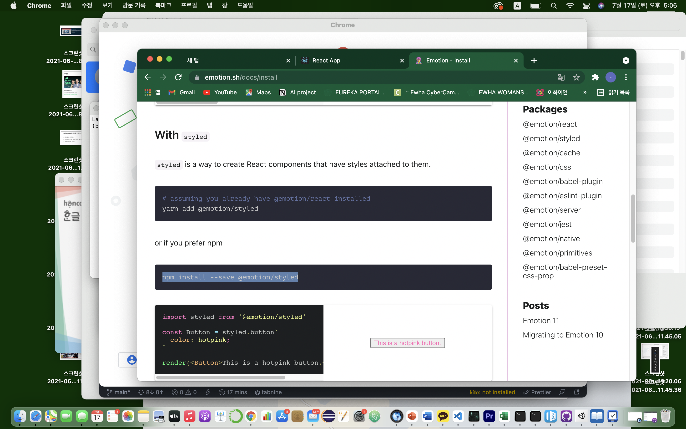
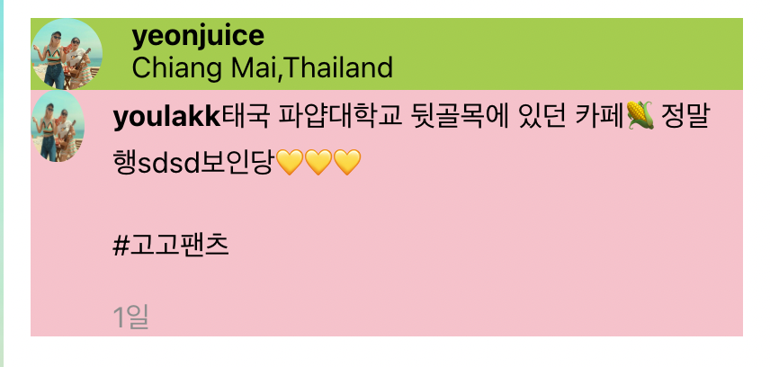
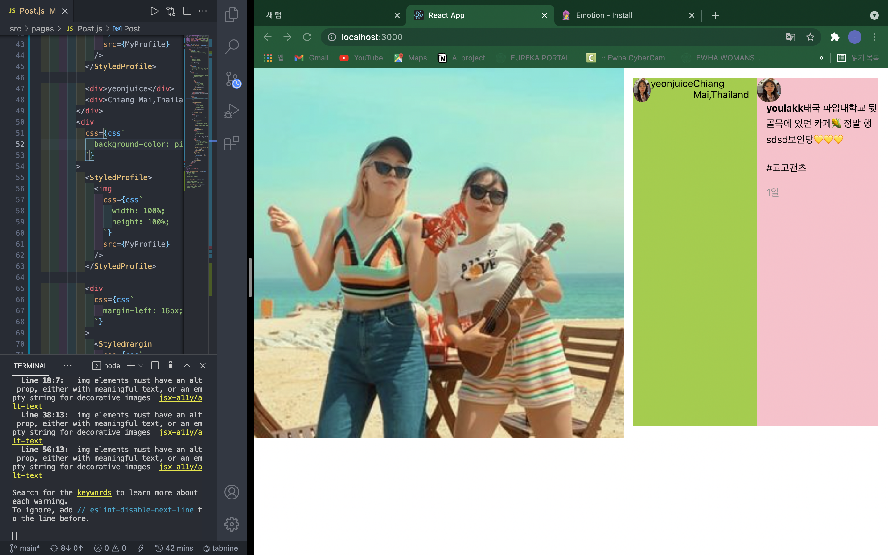

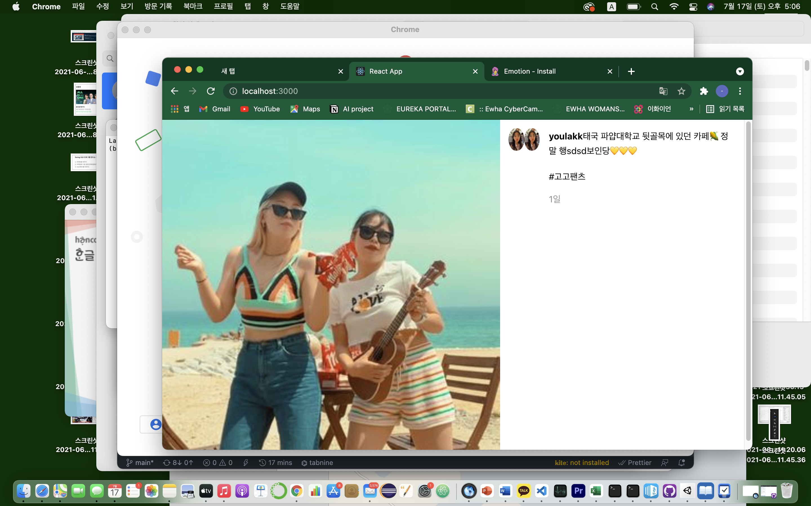

## 인증샷
|날짜|장소 및 시간|인증샷|
|:---:|:---:|:---:|
|20210703|@이화스터디카페 18:00~19:30(1H30M)||
|20210710|@이화스터디카페 15:30~17:30(2H)||
|20210711|@랭스터디카페 15:30~17:30(2H)|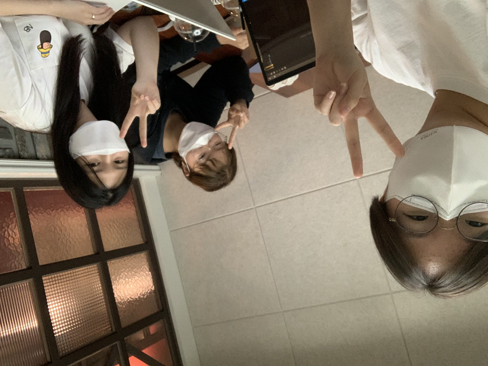|
