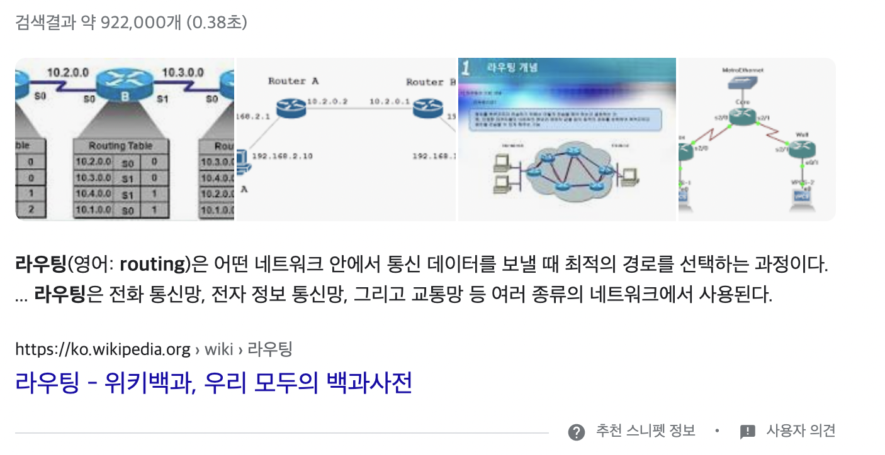
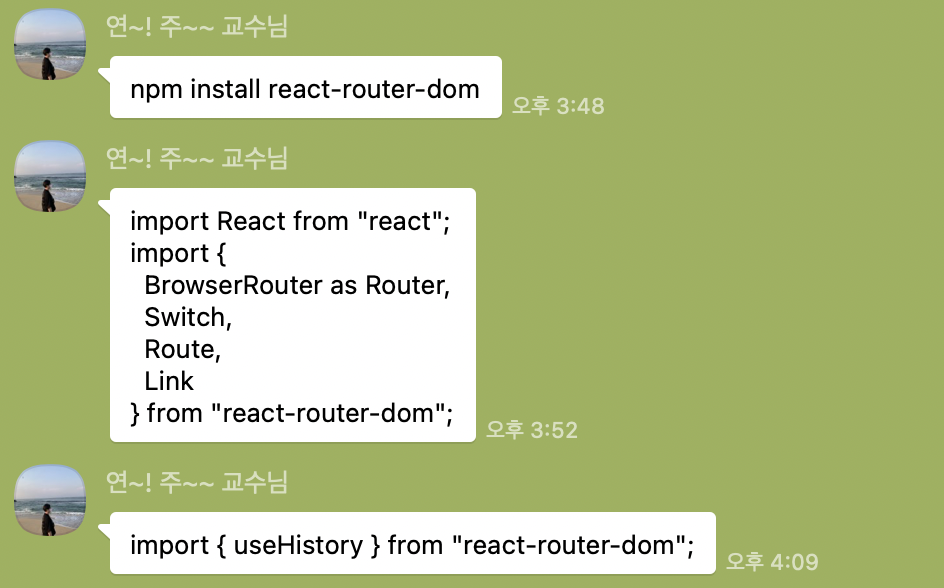
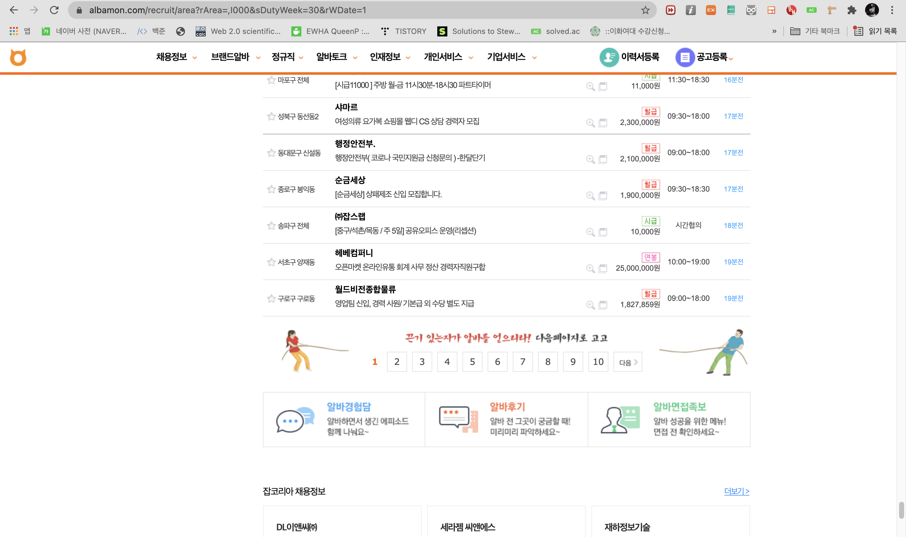
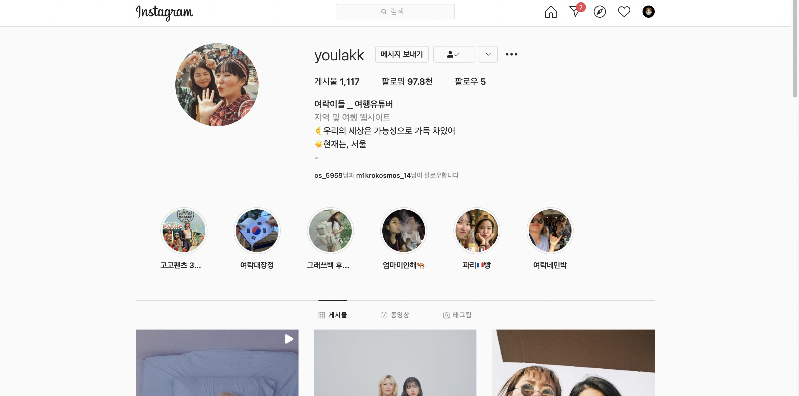
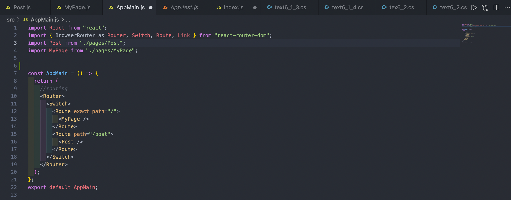
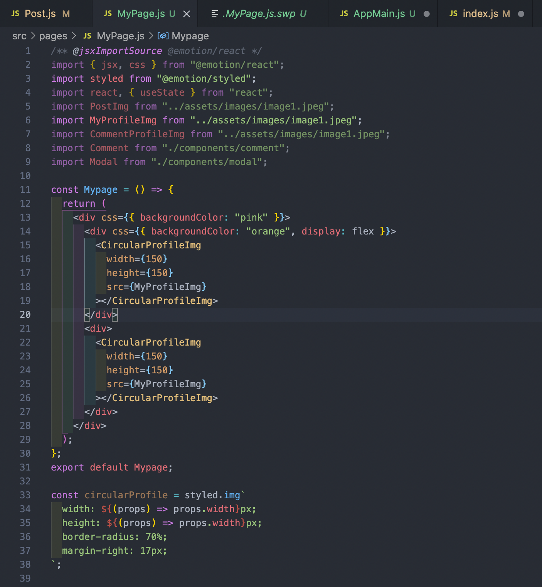
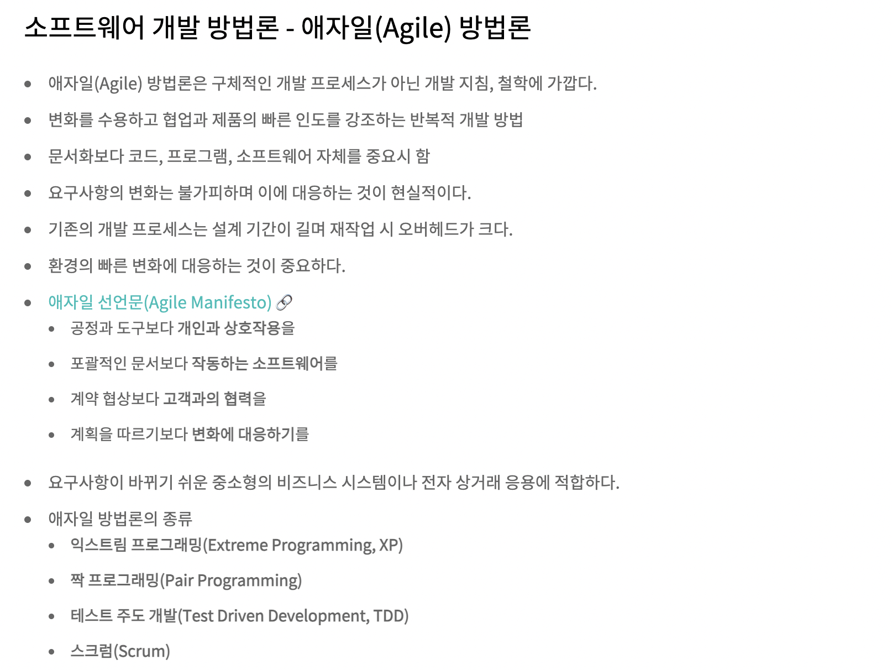
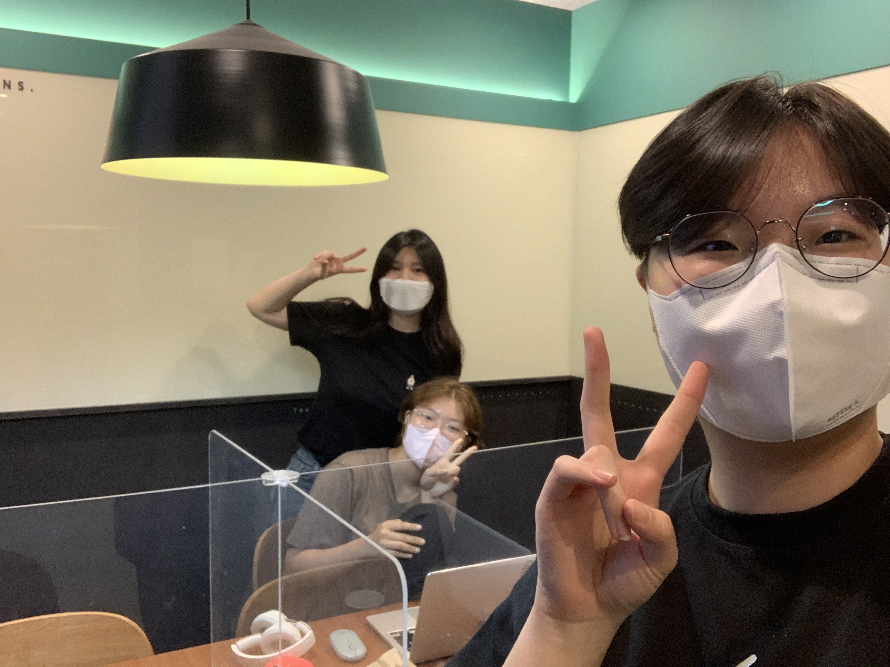

# 🐣 인스타그램 클론코딩 🐥
(멘토)서연주-(멘티)김수연, 임수안 HTML,CSS,React 공부 시작합니다!

## 인스타그램 웹페이지 만들어보기
### 클론코딩페이지

### 20210710

### 20210711

### 20210717

### 20210718

### 20210724~20210801


## 20210703 OT(이론)
### Github의 여러 기능(PR, Issue, 칸반보드, Action, 웹호스팅 등...)과 그 활용에 대해 알아보고 github 사용을 편리하게 해주는 툴을 소개했습니다.HTML, CSS, React가 무엇인지 간략하게 설명하고 아토믹 디자인과 css-in-js에 관해 알아보고 개발 환경 설정(Create React App과 Emotion)을 마쳤습니다. 이후 다음 시간부터 진행될 실습에 관해 간략하게 알아보았습니다.
오늘은 깃허브 쓰는 방법, html.css,.js.react가 무엇인지 배웠다. html은 뼈대. css는 겉모습, js는 뇌라고 했다. html이랑 css는 프로그래밍 언어가 아니라고 했다. 몰랐다. 아토믹 디자인에 대해서 배웠다. 웹사이트가 그냥 한 페이지로 이루어지는 줄 알았는데, 여러가지 요소로 이루어져있다는 것을 배웠다. 그리고 똑같은 디자인을 복붙하는 것은 코드 재사용성이 좋지 않다고 했다. 내가 객지프때 이렇게 했는데,,, 약간 객지프에서 배운 내용이랑 비슷한 내용이라고 느꼈다 이번에는 실습을 많이 해보면서 연습을 많이 해야겠다. 객지프때 실습을 충분히 안했더니 실력이 잘 안늘었던 것을 교훈삼아서 열심히 실습하겠다. 앞으로 가야할 길이 많다고 느꼈다. 열심히 해야겠다.!! 


## 20210710 인스타게시글 만들기!
### 오프라인으로 만나 학습활동을 진행했습니다. HTML Tag와 semantic한 태그 작성의 중요성에 대해서 언급하고 React Component와 그 중에서도 함수형 Component 사용에 대해 배웠습니다. 필요한 extension을 소개한 뒤 희망하는 인스타그램 페이지를 클론 코딩하는 실습을 시작하였습니다.
오늘은 직접 인스타 게시물 화면을 만들어 보았다. 큰 화면에서 같이 코딩하면서 에러가 생기면 바로바로 물어보고 고민할 수 있다는 점이 오프라인 수업의 큰 장점인 것 같다. 그리고 친한 사람과 하니 물어보기도 쉽고 질문하기도 쉬워서 부담감이 없어 좋았다! 인스타 게시물 화면을 아토믹하게 섹션별로 나눠보고 semantic한 것이 어떤 것인지에 대해 배웠다. 또 연주언니가 코딩할 때 사용하기 유용한 확장프로그램들을 여러개 알려줘서 prettier, bracket,, indent rainbow를 설치했다. 백준풀때는 그냥 에러입니다만 나와서 약간 재미가 없었는데, 리액트는 내가 쓴 코드를 바로 확인할 수 있어서 재밌었다. 학교에 리액트 수업은 없냐고 물어봤는데 아쉽게 없다고 했다 ㅠㅠ 언니 시간날 때 마다 졸라서 같이 수업하는 것처럼 열심히 배워야겠다 ㅎㅎ


## 20210711 
어제보다 인스타그램이랑 더 닮아가고 있어서 뿌듯하다. 오늘은 언니가 고급기능이라고 클릭기능을 가르쳐줬다. 그리고 해쉬태그랑 프로필을 클릭하면 설정해놓은 링크로 넘어갈 수 있도록 href를 사용했다. 지금은 하나의 페이지만을 만드는 것이라서 일일이 url을 입력해주지만, 만약 정말로 서비스를 운영할 때는 라우팅기능을 통해 자동으로 넘어갈 수 있다고 했다. 그리고 검색기능도 프론트엔드의 일이라고 했는데, 생각보다 프론트엔드도 할 일이 많은 것 같다. 내가 생각한 프론트엔드 개발자는 거의 웹디자이너 정도였다.... 인스타그램 웹화면에서 1일이라고 적혀있는 부분을 클릭하면 day변수가 하나씩 올라가서 1일 2일 3일.. 이렇게 증가하는 기능인데 정말 너무너무 신기했다. 이 기능은 좋아요기능을 사용할 때 쓰는 것이라고 했다. 이걸 보니 <거지키우기>게임이 생각났다. 거지키우기는 그냥 클릭을 하면 돈이 쌓이는 건데, 이렇게 클릭하는 걸로 웹페이지에서 게임을 만들 수 있을 것 같았다. 다음에 한 번 해봐야겠다. 평소에 프론트엔드에 별 관심이 없었는데, 코딩한 결과를 눈으로 바로 확인할 수 있는 점이 너무 매력적이다. 그리고 어제보다 결과물이 나아진 게 너무 뿌듯하다! 역시 꾸준히 하는 게 제일 중요한 것 같다. 


## 20210717
오늘 처음에 terminal로 react를 켰는데, 지난 번에 만들었던 건 없고, 그 전에 했던 파일이 자꾸 열려서 왜 그러는지 알아내느라고 시간을 많이 썼다. 알고보니 내가 만들어놓은 react_study 디렉토리 내에 src폴더 안에 post.js파일이 있어야 했는데, 내가 src폴더 안에는 구버전 파일을 올려놓고, 진짜 파일은 잘못된 위치에 둬서 그랬던 것이다. 파일 위치 관리를 똑바로 해야겠다는 생각을 했다. 원래 인스타그램 화면을 보면 프로필이 댓글에서도 반복된다. 그래서 그 부분은 복붙으로 여러 개 만들었다. 오늘은 댓글 부분을 만들었다. 아직 `display:flex`인 상태여서 댓글창이 내려오지 않고 게시글을 쓴 유저 측면에 위치한 상태이다. 진짜 인스타그램 화면처럼 보이고 싶으면 `display : flex-column`을 사용해줘야 한다. column은 '열'이라는 뜻이라서 flex상태임에도 게시글 밑으로 댓글이 내려올 수 있다. display가 더 구체화되었다고 보면 된다. 연주언니한테 굳이 `<div></div>`를 사용하지 않고, `display : flex-column`를 쓰는 이유를 물어봤더니, 가운데 정렬을 비롯한 여러 기능을 추가적으로 사용할 수 있기 때문이라고 했다. html/css의 세계는 정말 무궁무진한 것 같다. 😃


코드는 같은데, 왜 yeonjuice의 프로필사진은 찌그러지지 않고 youlakk만 찌그러지는지 고민하고 있었는데 언니가 위의 프로필은 애초에 찌그러질만큼 공간이 모자라지 않기 때문이라고 했다. 해상도나 모니터화면에 따라 자동적으로 ui같은 것을 조정해주는 건 정말 편한 기능이지만, 이럴때에는 좀 난감하다. 일단 `<div></div>`로 찌그러지지 않게 만들긴 했는데, 나머지는 내일 언니한테 다시 물어봐야지 ㅎㅎ


+++ 그리고 언니한테 Git convention이랑 gitmoji라는 extension에 대해서 배웠다. 도전학기 프로젝트를 하면서 너무 커밋메시지가 정신이 없어서 커밋컨벤션을 처음 접하게 되었는데, 이걸 이모지로 할 수 있다는 게 새삼 놀라우면서도 말그대로 `convention`인데 이모지라고 안될게 뭐람.? 이라는 생각이 동시에 들었다. 커밋히스토리가 예뻐져서 아주 깃헙 들어올 맛이 난다 ㅋㅋㅋㅋ

## 20210718
본격적으로 인스타 게시글과 비슷해지고 있다. 자잘한 `margin`도 넣어주면서 최대한 비슷하게 만들어보려고 하는 중이다. 클론코딩을 하면서 조금 신기했던 것은 px들이 5단위로 깔끔하게 나오는 게 아니고, 그냥 white라고 생각했던 색상도 색상코드를 보면 완전한 흰색은 아니라는 것, 생각보다 완전한 black,white는 잘 사용되지 않는다는 것이다. 오늘은 `margin`과 `padding`의 차이점에 대해 배웠다. 서로 다른 컴포넌트 사이에 간격을 준다는 점은 공통점으로 가지고 있지만, 어떻게(HOW)간격을 주냐는 점에서 다르다는 것을 배웠다. margin은 간격을 컴포넌트 밖으로 주고, padding은 안으로 주는 것이 차이점이다. 아래 이미지를 보면 더 이해가 쉽다!

  
#### 🤔 지금까지 완성한 post.js파일 코드


  
원래 인스타그램은 이런 색이 아니지만, 구역을 직관적으로 확인하기 위해서 색을 입혔다. 오늘 수업에서 가장 중요한 것은 <어디까지를 한 덩어리로 볼 것이냐?>라고 생각한다. 예를 들면, 아래 게시물에서 게시글을 쓴 사람의 정보가 나와있는 부분을 보면 `프로필사진+유저명 아래에 있는 위치` 아래에 공통적으로 여백을 줬다. 만약 이 둘을 한 덩어리로 `<div>`를 통해 묶어주지 않는다면, 프로필 사진 아래에도 여백(1) 그리고 위치정보 아래에도 여백(2)을 넣어줘야하기 때문에 불필요하게 코드가 길어지고 짜임새가 안좋아진다. 덤으로 유지/보수하기도 어려워진다. 왜냐하면 간격을 수정하기 위해 너무 많은 부분의 코드를 수정해줘야하기 때문이다. 

그리고 아래는 MOZILLA라는 사이트이다. 추가적으로 HTML,CSS태그의 정보에 대해 알고 싶을 때 활용하기 좋은 사이트이다.
https://developer.mozilla.org/ko/docs/Web/HTML/Element/span


그리고 저번에 변수명은 semantic해야 한다고 했는데, 내가 그걸 까먹고 대충 변수명을 hihi로 설정했더니 언니가 semantic하게 이름을 설정하라고 했다 !!    
-> 참고로 `semantic`하다는 것은 의미론적이라는 뜻이다. 예를 들어, 게시물을 감싸는 스타일태그를 생성할 때 그 태그명은 아무렇게나 지으면 안되고 `<StyledPost>`처럼 의미를 담아서 짓는 것을 권장한다는 것이다. 

#### ☑️ 이번주 과제
- 인스타그램 웹페이지 색상코드 알아오기

## 20210724~20210801 : 인스타그램 게시글 페이지 완성
- 튜터의 라이브 코딩과 멘티들끼리 적극적으로 서로를 알려주는 방식으로 튜터링이 진행되었으며, 댓글 컴포넌트 구성을 완성하고 해당 컴포넌트를 분리하여 사용하는 법을 익혔습니다.
또한 튜티의 질문에서 촉발되어 react 개념의 목차를 꼼꼼히 살펴보고 개념을 전체적으로 훑어보는 시간을 가졌습니다.


### 기능별로 코드 정리하기 + 배운 내용 복습 
1. 날짜 기능 만들기

## 20210807 튜터링 : AppMain페이지 만들기
- react에서 제공하는 라우팅기능을 사용했다. 라우팅이라는 용어를 웹호스팅할 때 들어본 적이 있어서 익숙하긴 했는데 정확하게 어떤 용어인지는 알지 못했었다. 이번 기회에 직접 해보면서 배울 수 있어서 재미있었다.
- 라우팅(영어: routing)은 어떤 네트워크 안에서 통신 데이터를 보낼 때 최적의 경로를 선택하는 과정이다.


라우팅은 전화 통신망, 전자 정보 통신망, 그리고 교통망 등 여러 종류의 네트워크에서 사용된다.(출처 : https://ko.wikipedia.org/wiki/%EB%9D%BC%EC%9A%B0%ED%8C%85) 리액트에서 제공하는 라우팅기능을 사용하기 위해 터미널엥서 `npm install react-router-dom`명령어를 통해 `react-router-dom패키지`를 다운로드 했다. 튜터링이 끝나고 해당 패키지에 대해 더 공부해보니 SPA앱을 만들 때 주로 사용된다고 한다. 그렇다면 `SPA`란 무엇일까?
  - SPA : Single Page Application (싱글 페이지 어플리케이션) 의 약자이다. 말 그대로, 페이지(page)가 1개(single)인 어플리케이션이란 뜻입니다. 전통적인 웹어플리케이션의 구조는, 여러 페이지로 구성되어있습니다. 유저가 요청 할 때 마다 페이지가 새로고침되며, 페이지를 로딩 할 때 마다 서버로부터 리소스를 전달받아 해석 후 렌더링을 합니다. 전통적인 웹어플리케이션의 예시가 정확히 어떤 것을 말하는지 모르겠으나, 계속해서 새로고침을 해야 정보가 업데이트가 되고 사용자가 1페이지, 2페이지 .. 이런 방식으로 넘겨가며 사용하는 방식인가보다. 내가 알고 있는 그런 페이지 중에는 알바몬페이지(https://www.albamon.com/recruit/area?rArea=,I000&sDutyWeek=30&rWDate=1)가 그런 것 같은데, 확실하게는 모르겠다. 
 
  - 하지만 여기에서 착각하면 안되는 점은 싱글페이지라고 해서 정말 만들어진 페이지가 1개라는 의미가 아니다. 예를들어 블로그를 만든다면, 홈, 포스트 목록, 포스트, 글쓰기 등의 화면(1개의 페이지가 아니다!)이 있겠고, 각 화면에 따라 주소를 만들어준다. 이 주소를 통해 사용자들이 페이지에 유입되기도 하고 북마크나 다른 서비스를 사용할 수도 있다. 즉, 각 주소에 따른 뷰를 보여주는 것을 라우팅이라고 한다.
  -  리액트 자체에는 이 기능이 내장되어있지 않기 때문에, 우리가 직접 브라우저의 API를 사용하고 상태를 설정하여 다른 뷰를 보여주어야 한다.
- 라우터(router)에는 3가지 타입이 있다. 그 중 우리가 만들고 있는 것은 웹이기 때문에 `react-router-dom`을 사용했다. **(출처:https://velopert.com/3417)**
  - `react-router-dom` : 웹
  - `react-router` : 웹&앱
  - `react-router-native` : 앱
  

- 아래의 페이지는 리액트 라우터의 공식 페이지이다. 언니가 더 공부하고 싶으면 이 사이트를 활용하라고 했다. -> https://reactrouter.com/web/guides/quick-start
- 오른쪽에 왼쪽의 설명에 대한 코드까지 같이 나와있어서 이해하기 더 쉽고 직관적이어서 좋다!

- 본격적으로 새로운 페이지를 만들기 시작한다!! 인스타그램에서 내 프로필을 클릭하면 자신의 프로필페이지로 넘어간다. 그리고 게시글에서 게시글 작성자의 프로필을 클릭하면 그 사람의 프로필로 넘어간다. 이를 `onClick`을 사용해서 연결해주고 저번에 만들어두었던 css들을 사용해서 동그란 프로필을 만들어주었다. 지금 내 프로필에는 없는데, 프로필 하단에 나오는 스토리도 같은 태그를 사용할 것이라고 했다. 아직 완성은 못했지만, 여기까지 하다가 튜터링이 끝났다. 내일 튜터링가서 마저 배우고 만들어야겠다!


- 라우터의 동작방식 -> 렌더링 순서를 중심으로
  - 라우터에는 `<BrowserRouter>` 가 보통 많이 사용되며 `<Link>` 와 `<Route>`를 통해서 라우팅을 구현하는 방식이다. 예를 들어, 홈페이지, 영화페이지, 리뷰페이지가 있다고 하자. 각각의 URL을 `/` , `/movies` , `/reviews`라고 했을 때, 다음과 같이 구현할 수 있다. 각각의 페이지에는 path 속성을 통해서 각각의 컴포넌트가 렌더링 되는 URL이 정해진다. 하지만 여기에서 신경써야할 부분이 있다.
```
import React from 'react';
import { BrowserRouter as Router, Route } from 'react-router-dom';

const Routes = () => {
    return (
    	<Router>
          <Route path="/" component={Home} />
          <Route path="/movies" component={Movies} />
          <Route path="/reviews" component={Reviews} />
        </Router>
    );
};
```
그러나 여기서의 문제점은, 홈페이지에 들어갔을 때 `/movies` 와 `/reviews` 또한 `/` 가 매칭되기 때문에 3개의 컴포넌트가 모두 렌더링된다는 것이다. `/`만 렌더링하고 싶었는데 3개의 페이지 전부 렌더링하게 되는 일이 발생한다. 이 문제를 해결할 수 있는 방법으론 크게 2가지가 있다.
1. `exact` : 정확한 경로의 사용
     - `/`가 포함되는 것이 아니라, 정확하게 `/`이라는 주소를 가지는 경우만 렌더링하는 것이다. 즉 부분적으로 일치하는 것이 아니라 정확하게 일치하는 URL의 컴포넌트를 렌더링시키는 방법을 사용할 수 있다.
```
import React from 'react';
import { BrowserRouter as Router, Route } from 'react-router-dom';

const Routes = () => {
    return (
    	<Router>
          <Route exact path="/" component={Home} />
          <Route path="/movies" component={Movies} />
          <Route path="/reviews" component={Reviews} />
        </Router>
    );
};
```
2. `<Switch>` : 여러 경로 중 첫번째(up->down) 경로 선택
  - `<Switch>`는 첫번째로 매칭되는 `path`를 가진 컴포넌트를 렌더링 시킨다. 이것이 `exact` `path` 와 다른 점은 첫번째 매칭만 본다는 것이다.
```
import React from 'react';
import { BrowserRouter as Router, Route, Switch } from 'react-router-dom';

const Routes = () => {
    return (
    	<Router>
          <Switch>
            <Route exact path="/" component={Home} />
            <Route path="/movies" component={Movies} />
            <Route path="/reviews" component={Reviews} />
          </Switch>
        </Router>
    );
};
```
- 아래 코드는 튜터링에서 인스타그램 페이지를 연결할 때 사용한 코드이다.
```
  const AppMain = () => {
  return (
    //routing
    <Router>
      <Switch>
        <Route exact path="/">
          <MyPage />
        </Route>
        <Route path="/post">
          <Post />
        </Route>
      </Switch>
    </Router>
  );
};
export default AppMain;
```

-`npm start`로 터미널에서 처음 리액트로 파일을 열면 지난 시간까지 만들었던 게시글 페이지가 나왔었다. 이는 그 페이지가 바로 뜨도록 첫시간(?..기억이 잘 안난다..)에 설정했기 떄문이다. 새삼 개발의 세계에서 <그냥>이라는 것은 없다는 것을 느꼈다... 언니가 인스타그램에 처음 접속하면 게시글 페이지가 먼저 나오는 게 맞는지 프로필이 먼저 나오는 게 맞는지 물어봤다. 프로필이 먼저 나오는 게 맞다고 대답했는데, 지금 생각해보니 아닌 것 같다. ㅋㅋㅋ 물론 처음에 뜨는 건 타임라인 형식이라서 우리가 지난 시간까지 만들어놓았던 페이지랑 살짝 다르기는 하지만, 어쨌든 게시글이 먼저 나오는 게 맞는데 언니가 그럴 수도 있지하면서 넘어갔다. 역시 연주언니는 최고의 튜터다...😎
```
ReactDOM.render(
  <React.StrictMode>
    <AppMain />
  </React.StrictMode>,
  document.getElementById("root")
);
```

- 오늘 튜터링 거의 끝자락에 문득 인스타그램과 같은 대형서비스를 만드려면 몇 명의 개발자가 얼마의 시간이 걸려서 만드는 것인지 궁금해서 언니한테 물어봤다. 언니가 물론 내부사정은 모르는 것이긴 하지만 최근에는 애자일 개발 방법론이 많이 쓰이기 때문에 내부에서는 훨씬 빨리 만들고 수차례의 피드백을 거쳐서 완성되었을 수도 있다고 했다.
- 애자일(agile a.신속한,민첩한) 방법론 : 애자일은 신속한 반복 작업을 통해 실제 작동 가능한 소프트웨어를 개발하여 지속적으로 제공하기 위한 소프트웨어 개발 방식
- 
#### 소감
2주정도 튜터링 끝나고 바로 내용정리를 못해서 며칠 지나서 하려고 하니 내용이 기억이 안나서 애를 먹었다.. 미리미리 복습하고 튜터링 복습 github에 업로드하기!! 새로운 페이지를 만드는 것도 재미있고 처음에는 낯설게 느껴졌던 react함수형태도 익숙해진 것 같아서 뿌듯하다. 2주치 복습도 빨리 해야지🔥🔥🙉

## 인증샷
|날짜|장소 및 시간|인증샷|
|:---:|:---:|:---:|
|20210703|@이화스터디카페 18:00~19:30(1H30M)||
|20210710|@이화스터디카페 15:30~17:30(2H)||
|20210711|@랭스터디카페 15:30~17:30(2H)||
|20210717|@이화스터디카페 15:30~17:30(2H)||
|20210718|@이화스터디카페 15:30~17:30(2H)||
|20210724|@이화스터디카페 15:30~17:30(2H)||
|20210725|@이화스터디카페 15:30~17:30(2H)||
|20210730|@이화스터디카페 15:30~17:30(2H)||
|20210801|@이화스터디카페 15:30~17:30(2H)||
|20210807|@이화스터디카페 15:30~17:30(2H)||
